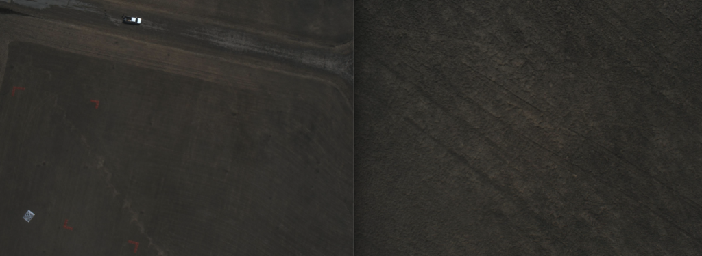
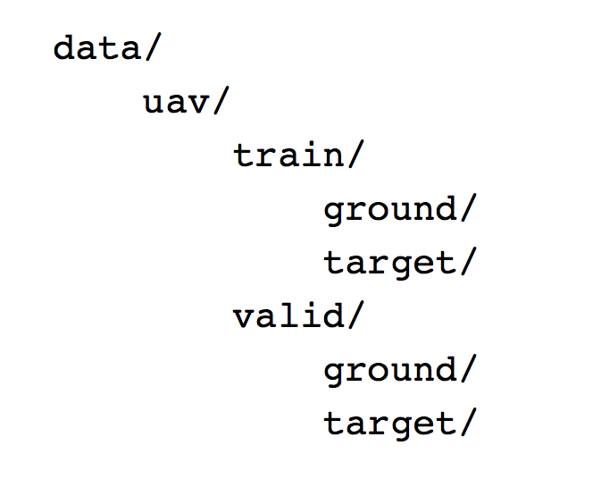
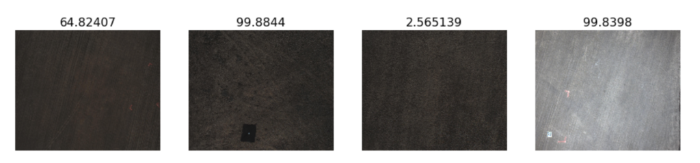
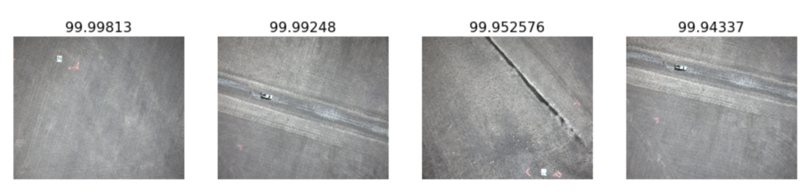

Being as wrapped up in the tech industry as I am, I knew it would only be a matter of time until I would try my hand at some deep learning. For me, the motivation to get stated came from two things; the realization that deep learning and ML are just another tool in the modelling toolbox, and the availability of a top-down and free course called FastAI.

As I tend to do, this article will be part tutorial (I’ll share the steps and interesting things I’ve found), and part observational in nature. Let’s start learning!

 

### My Interest in ML and Deep Learning
I’m interested in applying machine learning to the following areas:

- analysis of satellite and drone data (telemetry and imagery)
- robotics applications, such as path planning and obstacle avoidance
- stock and forex training (deep earning)
- ML in embedded systems

I’m not as interested in algorithm development – at least the low level stuff. To me, machine learning approaches are a tool. Combining tools together in interesting ways is great and fun, and looks like making different function calls. Digging into the guts of TensorFlow is something I’ll leave to the researchers. What’s great about this area is that the bleeding-edge research is quickly being implemented in various ML toolkits, making the state of the art approaches available to us so we can tinker with them. The pace at which this is all happening is absolutely blistering – and it’s great that us (aspiring) practitioners who want to use it to get things done have (essentially free) access to the world’s best knowledge.

Over the past little while, I’ve watched many hours of deep learning video and courses. However, none of them really helped the concepts click, until I stumbled across fast.ai. This is a relatively short course that revolves their PyTorch-based library of the same name. The explanations are clear, the code works out of the box, and the instructor mentions the tips and tricks for how to apply the techniques and have them work better. The last point is the key for me – you can get the basics anywhere, but it’s the tricks that’ll get you out of a hole. Fast.ai includes these, and I really appreciate it.

 

### Deep Learning Without a GPU

Fast.ai starts off with details about a few ways to get GPU access. I decided to see how far I could get without a GPU using just my macbook pro (early 2015 with Intel Iris 6100 graphics). It turns out, that with my small test data set, training times were quite acceptable to me – a few minutes or less for 20 epochs of 100 or so 224px images. Given that for my test set, I don’t actually have any more data, this was totally fine. In the future, I’ll get everything running on my desktop which has a GTX650 and we’ll benchmark the difference.

One free way to get GPU access is through Google Collab, which can run Jupyter notebooks and has a GPU accelerator option. Details are here. However, I found it a bit tricky to deal with my own files in Collab, and there were long delays while I’m assuming I was queued for GPU access. It was much smoother to run on my local machine, at least for me. Still though, it’s free GPU access, which is pretty amazing. Thanks Google!

 

### Setting up FastAI

The FastAI videos go through some installation, but I decided to go it on my own. Here are the steps I took:

**Install anaconda**

```
git clone https://github.com/fastai/fastai.git
cd fastai
```

run the CPU-only install option:
`conda env update -f environment-cpu.yml`


You can enter the environment with:
```
conda activate fastai-cpu
cd courses/dl1
```


In the course directory, you can open up lesson 1 by launching jupyter and browsing for the lesson 1 notebook. I made a copy of it too.

 `jupyter notebook`

Now you can work your way through by running the cells with shift+enter. Hopefully you’re watching the videos too. I ended up having to reinstall opencv as it wasn’t playing nice with MacOS. There’s lots of information out there about how to fix any errors that may come up, but it’ll probably be much smoother overall if you install under Ubuntu. That’s what I’ll do when I spin it up on my desktop.
 

### Working With Drone Images

Initially I wasn’t quite sure about the data I wanted to work with. Then I remembered that I have a set of images taken at the Unmanned Systems Canada 2016 competition. Most of these images are of the dry grass surrounding the Southport, Manitoba airfield. However, there are some large arrow shapes and QR codes in some of the images. Our task at the competition was to geo-locate these features, find their enclosed area (for the arrows), or decode them (for the QR code).



*Left: image with ground features, Right: uninteresting image*


 

Since our image downlink wasn’t working during the flight, as soon as we landed the drone, we grabbed the SD card from the vision computer and rapidly did a manual screen of the images. I remember it being really difficult to see the images in the brightly-lit tent, and I definitely hid under a jacket to reduce the glare. Our task was to sort out all of the images with an arrow or QR code so we could process them further. The question is, can we instead do this with deep learning?

 

### Yes we Can

Part of what’s neat about finally experimenting with something after observing it for a while is finally answering your questions. One of those was how data should be organized to feed it into a model. That brings me to the file structure, which looked like this.


*File structure*

### Data folder structure
 

So it’s straightforward – just a training and validation set, and the two classes of images are split manually into each directory. I ended up with 50 examples of each class, so 25 for each class in the training and validation sets. This is a very small amount of data by DL standards, but it’s workable when we’re just using a CPU to train the model.

To start, I kept the same setup as the lesson. The model is a pre-trained Resnet34, said to be useful for image classification purposes. This is a convolutional neural network, meaning it performs convolutions to extract features. Basically this means it will “wipe” a matrix (kernel) across an image, and perform a matrix operation at each step of the wipe. This has the effect of consolidating data in a specific area, and it can, for example, effectively outline edges of shapes in an image. That’s just one part of this, and as I said, I’m not a low level algorithm guy – the details are better found elsewhere. Back to the results for us!

 
```python
arch = resnet34
sz = 224 # images will be resized to this size
data = ImageClassifierData.from_paths(PATH, tfms=tfms_from_model(arch, sz))
learn = ConvLearner.pretrained(arch, data, precompute=True)
learn.fit(0.01, 15)
```

*First run of the model*
 

This was a pre-trained model, so we just updated the last layers in the model to recognize our particular problem. Each iteration took about 1 second on my CPU, with images of size 224 px. We ended up at 94.2% accuracy.

 

A classifier will create a prediction for the class of an image. Like weather, 50% means we don’t have a preference either way as to which class it is. For me, 1 (100%) is target and 0 is bare ground.



*A selection of images and their class prediction (100 is target, 0 is ground).*
 

From the images above you can see that larger, more obvious features get picked up as a stronger target prediction (images 2 and 4). The first image only has faint arrows in it, and therefore a less confident (closer to 50%) prediction that it’s a target. Pretty neat!

 

*Most confident target predictions.*

### Conclusion

This was an interesting experiment, and it’s encouraging to see how straightforward it is to get a model running, and how good the results were. Looking at the mis-classified data, there appear to only be one or two images (I tweaked my image sets a bit since taking the screenshots). The misses are shadowy pieces of arrows, and are even difficult for me to classify. Given the small amount of data, I’m impressed.

 

I did not find that data augmentation helped with these images. It makes sense, as the arrows appear in all different orientations in the data anyway, so the net is exposed to a variety of versions of the same thing. Tweaking contrast and brightness would likely help for these images, as they’re quite dull and flat even for a human to process.

 

Currently I plan to write some more friendly wrapper functions for this library. Ones that don’t error out when there are no incorrectly classified images, for example. Beyond that, I plan to experiment with the course content a bit more, get more of a feel for deep learning, and then tackle a couple of projects I’ve had in mind.

If you’re interested in giving deep learning a go, don’t hesitate. There are many resources out there, and it’s easy to get going on small data sets with a mainstream computing setup.